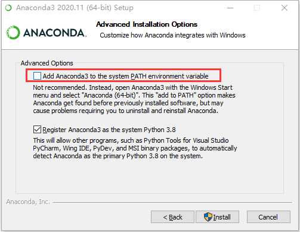

# 动手学深度学习——1. 环境搭建
记录一下学习深度学习的一些。本篇简述如何在Windows上搭建一个深度学习的环境。
目前所使用的平台：

- Windows 10
- 8700K
- GeForce RTX 2070
- CUDA 10.1
## 安装显卡驱动

[Download](https://www.nvidia.cn/Download/index.aspx?lang=cn)

## 安装CUDA和cudnn

官网：

- [CUDA 10.1](https://developer.download.nvidia.com/compute/cuda/10.1/Prod/local_installers/cuda_10.1.243_426.00_win10.exe)
- [cudnn 7.6.5](https://developer.nvidia.com/compute/machine-learning/cudnn/secure/7.6.5.32/Production/10.1_20191031/cudnn-10.1-windows10-x64-v7.6.5.32.zip)

百度网盘：

- [CUDA 10.1](https://pan.baidu.com/s/18HIv03nKK4V5aMikGxirRA )：nljy 

- [cudnn](https://pan.baidu.com/s/1eW0Tl3pZqcb-SDzQDREMww)：whqa

  CUDA 的安装按照向导一路下一步即可，cudnn 将压缩包解压得到的文件拷贝到 CUDA 的安装目录 `C:\Program Files\NVIDIA GPU Computing Toolkit\CUDA\v10.1` 即可。

## 安装Anaconda
安装 Anaconda 来安装和管理 Python。

**下载地址：**

- [Individual Edition](https://www.anaconda.com/products/individual#Downloads)

安装过程中选择一下安装地址，和勾选添加到环境变量即可，方便在 cmd 中直接执行 conda。



## 安装 Pytorch

通过 conda 创建一个名为 `torch` 的环境

```shell
conda create -n torch python=3.8
```

激活环境 `torch`

```shell
conda activate torch
```

安装 Pytorch

```shell
conda install pytorch==1.7.1 torchvision==0.8.2 torchaudio==0.7.2 cudatoolkit=10.1 cudnn -c pytorch
```

测试

```shell
python
```

```python
>>> import torch
>>> torch.__version__
'1.7.1'
>>> torch.cuda.is_available()
True
>>> exit()
```

## 安装 Tensorflow

通过 conda 创建一个名为 `tf` 的环境

```shell
conda create -n tf python=3.8
```

激活环境 `tf`

```shell
conda activate tf
```

安装 Tensorflow

```shell
conda install tensorflow-gpu=2.3.0 cudatoolkit=10.1 cudnn
```

测试

```shell
python
```

```python
>>> import tensorflow as tf
2021-03-20 13:20:12.902836: I tensorflow/stream_executor/platform/default/dso_loader.cc:48] Successfully opened dynamic library cudart64_101.dll
>>> tf.__version__
'2.3.0'
>>> tf.test.is_gpu_available()
WARNING:tensorflow:From <stdin>:1: is_gpu_available (from tensorflow.python.framework.test_util) is deprecated and will be removed in a future version.
Instructions for updating:
Use `tf.config.list_physical_devices('GPU')` instead.
2021-03-20 13:23:44.439795: I tensorflow/core/platform/cpu_feature_guard.cc:142] This TensorFlow binary is optimized with oneAPI Deep Neural Network Library (oneDNN)to use the following CPU instructions in performance-critical operations:  AVX AVX2
To enable them in other operations, rebuild TensorFlow with the appropriate compiler flags.
2021-03-20 13:23:44.448927: I tensorflow/compiler/xla/service/service.cc:168] XLA service 0x20818dcf680 initialized for platform Host (this does not guarantee that XLA will be used). Devices:
2021-03-20 13:23:44.451290: I tensorflow/compiler/xla/service/service.cc:176]   StreamExecutor device (0): Host, Default Version
2021-03-20 13:23:44.453949: I tensorflow/core/common_runtime/gpu/gpu_device.cc:1716] Found device 0 with properties:
pciBusID: 0000:01:00.0 name: GeForce RTX 2070 computeCapability: 7.5
coreClock: 1.71GHz coreCount: 36 deviceMemorySize: 8.00GiB deviceMemoryBandwidth: 417.29GiB/s
2021-03-20 13:23:44.457513: I tensorflow/stream_executor/platform/default/dso_loader.cc:48] Successfully opened dynamic library cudart64_101.dll
2021-03-20 13:23:44.459324: I tensorflow/stream_executor/platform/default/dso_loader.cc:48] Successfully opened dynamic library cublas64_10.dll
2021-03-20 13:23:44.461082: I tensorflow/stream_executor/platform/default/dso_loader.cc:48] Successfully opened dynamic library cufft64_10.dll
2021-03-20 13:23:44.462932: I tensorflow/stream_executor/platform/default/dso_loader.cc:48] Successfully opened dynamic library curand64_10.dll
2021-03-20 13:23:44.464674: I tensorflow/stream_executor/platform/default/dso_loader.cc:48] Successfully opened dynamic library cusolver64_10.dll
2021-03-20 13:23:44.466823: I tensorflow/stream_executor/platform/default/dso_loader.cc:48] Successfully opened dynamic library cusparse64_10.dll
2021-03-20 13:23:44.468662: I tensorflow/stream_executor/platform/default/dso_loader.cc:48] Successfully opened dynamic library cudnn64_7.dll
2021-03-20 13:23:44.470474: I tensorflow/core/common_runtime/gpu/gpu_device.cc:1858] Adding visible gpu devices: 0
2021-03-20 13:23:44.867750: I tensorflow/core/common_runtime/gpu/gpu_device.cc:1257] Device interconnect StreamExecutor with strength 1 edge matrix:
2021-03-20 13:23:44.869689: I tensorflow/core/common_runtime/gpu/gpu_device.cc:1263]      0
2021-03-20 13:23:44.870798: I tensorflow/core/common_runtime/gpu/gpu_device.cc:1276] 0:   N
2021-03-20 13:23:44.872020: I tensorflow/core/common_runtime/gpu/gpu_device.cc:1402] Created TensorFlow device (/device:GPU:0 with 6228 MB memory) -> physical GPU (device: 0, name: GeForce RTX 2070, pci bus id: 0000:01:00.0, compute capability: 7.5)
2021-03-20 13:23:44.876644: I tensorflow/compiler/xla/service/service.cc:168] XLA service 0x20847c6d230 initialized for platform CUDA (this does not guarantee that XLA will be used). Devices:
2021-03-20 13:23:44.878938: I tensorflow/compiler/xla/service/service.cc:176]   StreamExecutor device (0): GeForce RTX 2070, Compute Capability 7.5
True
>>> exit()
```

## 安装 Paddle

通过 conda 创建一个名为 `paddle` 的环境

```shell
conda create -n paddle python=3.8
```

激活 `paddle` 环境

```shell
conda activate paddle
```

安装 Paddle

```shell
conda install paddlepaddle-gpu==2.0.1 cudatoolkit=10.1 cudnn -c paddle
```

测试

```shell
python
```

```shell
>>> import paddle
>>> paddle.utils.run_check()
Running verify PaddlePaddle program ...
W0320 13:37:05.188200  6200 device_context.cc:362] Please NOTE: device: 0, GPU Compute Capability: 7.5, Driver API Version: 11.2, Runtime API Version: 10.1
W0320 13:37:05.234077  6200 device_context.cc:372] device: 0, cuDNN Version: 7.6.
PaddlePaddle works well on 1 GPU.
W0320 13:37:08.160290  6200 build_strategy.cc:171] fusion_group is not enabled for Windows/MacOS now, and only effective when running with CUDA GPU.
PaddlePaddle works well on 1 GPUs.
PaddlePaddle is installed successfully! Let's start deep learning with PaddlePaddle now.
>>> exit()
```

