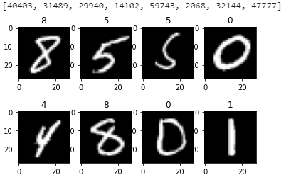

# 动手学深度学习——2.HelloWorld

记录一下学习深度学习的一些。本篇简述如何在Windows上完成深度学习的HelloWorld——MNIST。
所使用的平台：

- Windows 10
- 8700K
- GeForce RTX 2070
- CUDA 10.1

## MNIST

MNIST 是一个手写数字的数据集，图像为 28*28 的黑白数字图像，60,000 个训练样本，10,000 个测试样本。

下载地址：

- [Homepage](http://yann.lecun.com/exdb/mnist/)
- [百度网盘](https://pan.baidu.com/s/147X_wa999lQPeKm0NcTxyg)：0e3v

## HelloWorld

激活 `torch` 环境

```shell
conda activate torch
```

安装 **jupyterlab**，不安装也可，直接执行 python 脚本即可。

```shell
conda install -c conda-forge jupyterlab
```

 启动 jupyterlab

```shell
jupyter lab
```

解压 MNIST

```python
import os
import gzip

mnist_dir = "./data" # 下载的MNIST的文件夹路径
X_train_fpath = os.path.join(mnist_dir, "train-images-idx3-ubyte.gz")
Y_train_fpath = os.path.join(mnist_dir, "train-labels-idx1-ubyte.gz")
X_test_fpath = os.path.join(mnist_dir, "t10k-images-idx3-ubyte.gz")
Y_test_fpath = os.path.join(mnist_dir, "t10k-labels-idx1-ubyte.gz")
with gzip.open(X_train_fpath, 'rb') as f:
    X_train_content = f.read()
with gzip.open(Y_train_fpath, 'rb') as f:
    Y_train_content = f.read()
with gzip.open(X_test_fpath, 'rb') as f:
    X_test_content = f.read()
with gzip.open(Y_test_fpath, 'rb') as f:
    Y_test_content = f.read()
```

查看训练样本和标签

```python
import random
import numpy as np
import matplotlib.pyplot as plt

X_train = []
Y_train = []

for i in range(16, X_train_bytes, num_pixels):
    # 读取784个字节并转换为numpy数组形式，再reshape为28*28
    ndata = np.frombuffer(X_train_content[i:i+num_pixels], dtype=np.uint8).reshape(28,28,1)
    X_train.append(ndata)
    
for i in range(8, Y_train_bytes):
    Y_train.append(Y_train_content[i])

X_train = np.array(X_train)
Y_train = np.array(Y_train)

# 随机挑选8个看一下
choices = random.sample(range(X_train_images), 8)
labels = Y_train[choices]
print(choices)
for i in range(8):
    plt.subplot(2, 4, i+1)
    plt.imshow(X_train[choices[i]], cmap='gray')
    plt.title("{i}".format(i=labels[i]))
plt.show()
```



将训练集划分为训练集和验证集，比例 7:3

```python
X_train, X_val, Y_train, Y_val = train_test_split(X_train, Y_train, test_size=0.3, random_state=123)
```

网络结构

```shell
Net(
  (conv1): Conv2d(3, 32, kernel_size=(3, 3), stride=(1, 1))
  (conv2): Conv2d(32, 64, kernel_size=(3, 3), stride=(1, 1))
  (fc1): Linear(in_features=9216, out_features=128, bias=True)
  (fc2): Linear(in_features=128, out_features=1, bias=True)
)
```

训练

```python
import time
import copy
from torch.optim import Adam, lr_scheduler

os.environ['CUDA_LAUNCH_BLOCKING'] = '1'
device = torch.device("cuda:0" if torch.cuda.is_available() else "cpu")
model = net.to(device)
criterion = nn.CrossEntropyLoss()
optimizer = Adam(model.parameters(), lr=1e-3)
epochs = 10

since = time.time()
best_model_wts = copy.deepcopy(model.state_dict())
best_acc = 0.0
for epoch in range(epochs):
    print('Epoch {}/{}'.format(epoch, epochs - 1))
    print('-' * 10)

    for phase in ['train', 'val']:
        if phase == 'train':
            print('train')
            model.train()
        else:
            model.eval()

        running_loss = 0.0
        running_corrects = 0

        for inputs, labels in dataloaders[phase]:
            inputs = inputs.to(device)
            labels = labels.to(device)

            optimizer.zero_grad()

            # forward
            with torch.set_grad_enabled(phase == 'train'):
                outputs = model(inputs)
                _, preds = torch.max(outputs, 1)
                loss = criterion(outputs, labels)

                # backward
                if phase == 'train':
                    loss.backward()
                    optimizer.step()
            # statistics
            running_loss += loss.item() * inputs.size(0)
            running_corrects += torch.sum(preds == labels.data)

        epoch_loss = running_loss / dataset_sizes[phase]
        epoch_acc = running_corrects.double() / dataset_sizes[phase]
        print('{} Loss: {:.4f} Acc: {:.4f}'.format(phase, epoch_loss, epoch_acc))
        if phase == 'val' and epoch_acc > best_acc:
            best_acc = epoch_acc
            best_model_wts = copy.deepcopy(model.state_dict())
    print()
time_elapsed = time.time() - since
print('Training complete in {:.0f}m {:.0f}s'.format(time_elapsed // 60, time_elapsed % 60))
print('Best val Acc: {:4f}'.format(best_acc))
```

```shell
Epoch 0/9
----------
train Loss: 0.3753 Acc: 0.8850
val Loss: 0.1623 Acc: 0.9538

Epoch 1/9
----------
train Loss: 0.1269 Acc: 0.9625
val Loss: 0.1113 Acc: 0.9677

Epoch 2/9
----------
train Loss: 0.0931 Acc: 0.9720
val Loss: 0.0959 Acc: 0.9723

Epoch 3/9
----------
train Loss: 0.0738 Acc: 0.9775
val Loss: 0.0927 Acc: 0.9734

Epoch 4/9
----------
train Loss: 0.0637 Acc: 0.9815
val Loss: 0.0772 Acc: 0.9782

Epoch 5/9
----------
train Loss: 0.0573 Acc: 0.9827
val Loss: 0.0752 Acc: 0.9778

Epoch 6/9
----------
train Loss: 0.0502 Acc: 0.9846
val Loss: 0.0767 Acc: 0.9777

Epoch 7/9
----------
train Loss: 0.0439 Acc: 0.9861
val Loss: 0.0747 Acc: 0.9795

Epoch 8/9
----------
train Loss: 0.0426 Acc: 0.9862
val Loss: 0.0737 Acc: 0.9796

Epoch 9/9
----------
train Loss: 0.0375 Acc: 0.9883
val Loss: 0.0735 Acc: 0.9799

Training complete in 0m 45s
Best val Acc: 0.979889
```

测试

```python
# 读取最佳权重
model.load_state_dict(best_model_wts)
model.eval()

with torch.no_grad():
    for inputs, labels in test_dataloader:
        inputs = inputs.to(device)
        labels = labels.to(device)
        outputs = model(inputs)
        _, preds = torch.max(outputs, 1)
        corrects += torch.sum(preds == labels.data)
print("Test Acc: {:.4f}".format(corrects.double() / total))
```

```shell
Test Acc: 0.9827
```

## code

完整代码：

- [notebook](../code/2.HelloWorld/hello_world.ipynb)
- [script](../code/2.HelloWorld/hello_world.py)