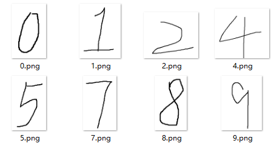
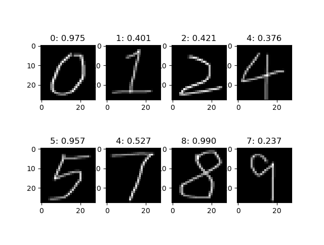

# 动手学深度学习——3. 数字识别

记录一下学习深度学习的一些。本篇简述如何在 Windows 上用上篇训练的 MNIST 模型来进行数字识别。
所使用的平台：

- Windows 10
- 8700K
- GeForce RTX 2070
- CUDA 10.1

## 数据准备

用 Windows 上的画图工具随便写几个数字



和 MNIST 的数据有一点差别，MNIST 的是黑底白字，而画图生成的是白底黑字，可以直接用画图修改成黑底白字，也可以用代码使用二值化函数生成

```python
img = Image.open(img_path).convert('L')
img = img.point(lambda p: p < 100 and 255)
```

## 加载模型

模型还是使用上一篇定义的网络，上篇模型中将 Dropout 定义在 forward 而不是 init 里，导致bug，多次预测结果不一致，[解决方案](https://stackoverflow.com/questions/53879727/pytorch-how-to-deactivate-dropout-in-evaluation-mode)

```shell
Net(
  (conv1): Conv2d(1, 32, kernel_size=(3, 3), stride=(1, 1))
  (conv2): Conv2d(32, 64, kernel_size=(3, 3), stride=(1, 1))
  (dropout1): Dropout(p=0.25, inplace=False)
  (fc1): Linear(in_features=9216, out_features=128, bias=True)
  (dropout2): Dropout(p=0.5, inplace=False)
  (fc2): Linear(in_features=128, out_features=10, bias=True)
)
```

加载训练好的权重文件

```python
checkpoint = '../../checkpoints/mnist.pt' # 训练完成的权重文件的路径
net = Net()
device = torch.device('cuda' if torch.cuda.is_available() else 'cpu')
model = net.to(device)
model.load_state_dict(torch.load(checkpoint))
```

## 预测

预测前要将图像缩放至28*28的大小，并将灰度值压缩至 [0,1]

```python
transform = transforms.Compose([
	transforms.Resize((28, 28)),
    transforms.ToTensor(),
])
```

其中 `Resize` 完成缩放，`ToTensor` 完成数值压缩至 [0,1]，并将类型转换为 `torch.Tensor`

数据预处理完成后，用模型进行预测，再调用 `softmax` 将结果压缩至 [0,1]

```python
for i, path in enumerate(paths, start=1):
    plt.subplot(row, col, i)
    img_path = str(path)
    img = Image.open(img_path).convert('L')
    img = img.point(lambda p: p < 100 and 255)
    tensor = transform(img)
    tensor = tensor.unsqueeze(0).to(device)
    output = model(tensor)
    preds = F.softmax(output, 1)
    v, idx = preds.topk(1)
    img = img.resize((28, 28))
    plt.imshow(img, cmap='gray')
	plt.title("{}: {:.3f}".format(idx.item(), v.item()))
plt.show()
```



可以看出7，9预测出错，还有1，2，4预测正确但分值不高，0，5，8的预测正确且分值高，说明这个模型的能力还不够强大。

## Code

- [notebook](../code/3.DigitalRecognition/digital_recognition.ipynb)
- [script](../code/3.DigitalRecognition/digital_recognition.py)