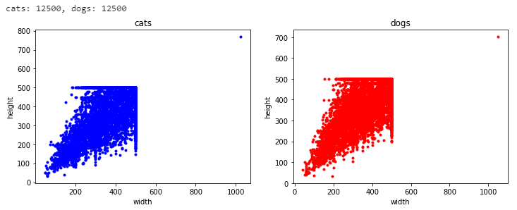
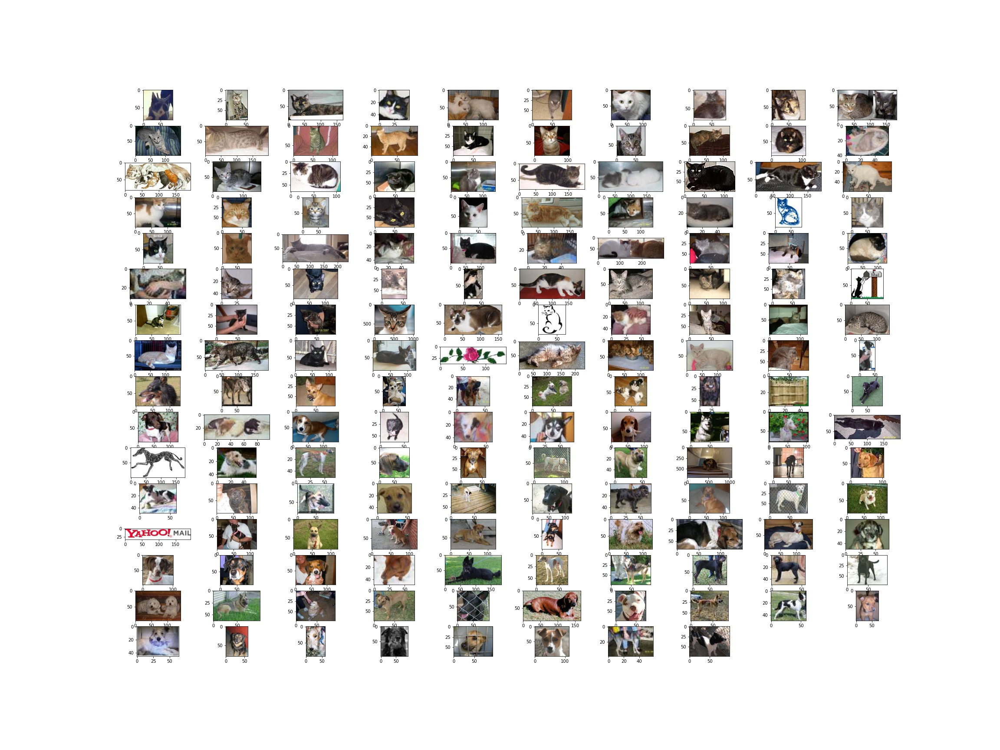
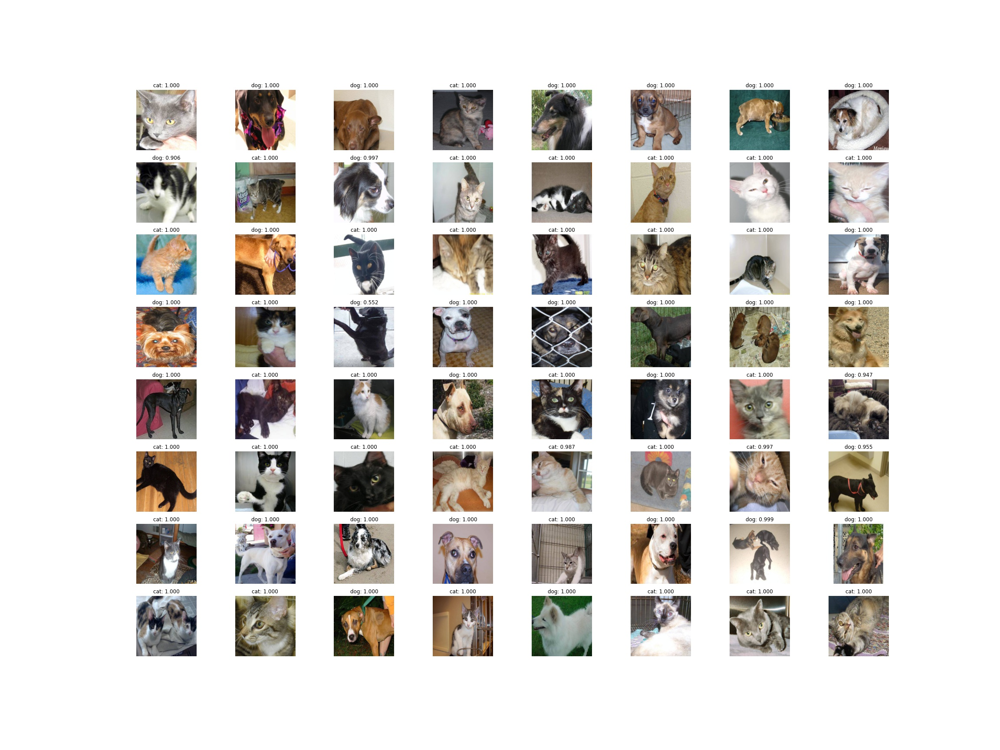

# 动手学深度学习——4. 猫狗大战

记录一下学习深度学习的一些。本篇简述如何在 Windows 上训练一个模型来识别猫狗。
所使用的环境：

- Windows 10
- 8700K
- GeForce RTX 2070
- CUDA 10.1
- Python 3.8
- Pytorch 1.7.1

## 数据准备

猫狗大战的数据集找不到官网，这里使用 [Kaggle](https://www.kaggle.com/) 的数据集，也提供百度网盘的下载地址。

- [Kaggle](https://www.kaggle.com/c/dogs-vs-cats/data)
- [百度网盘](https://pan.baidu.com/s/1NgIqeF5Fghm6RLcupiy8sQ)：8nr6

### 数据查看

下载完数据后，解压，可以看到训练数据集的图片都以 `cat.xxx.jpg` 和 `dog.xxx.jpg` 命名，可以从名字中获取标签，而测试数据集的标签无法提取，emmm，不嫌累的可以直接一张张标注。

再查看一些其他信息。



可以看到有 12,500 只猫和 12,500 只狗，图像的高宽大约为500，有部分特别小，有两个特别大，查看一下



可以看到其中有部分脏数据，这对模型的训练会造成很大的困扰，但是 25,000 张图像要清洗一遍太费精力了，待解决。

### 定义数据集

数据集中的图像有大有小，训练模型要求输入是统一大小的，直接将图像缩放至统一大小对人类判别猫狗影响不大，因此将所有的图像全部缩放至 256，再随机裁剪至 224，进行数据增强。

```python
transform = {
    'train': transforms.Compose([
        transforms.Resize((256,256)),
        transforms.RandomCrop(224),
        transforms.ToTensor(),
        transforms.Normalize([0.485, 0.456, 0.406], [0.229, 0.224, 0.225])
    ]),
    'val': transforms.Compose([
        transforms.Resize((256,256)),
        transforms.CenterCrop(224),
        transforms.ToTensor(),
        transforms.Normalize([0.485, 0.456, 0.406], [0.229, 0.224, 0.225])
    ])
}

datasets = {
    'train': DogsCatsSet(train_set, transform['train']),
    'val': DogsCatsSet(val_set, transform['val'])
}

data_sizes = {
    'train': len(datasets['train']),
    'val': len(datasets['val'])
}

dataloaders = {
    'train': DataLoader(datasets['train'], batch_size=batch_size, shuffle=True, pin_memory=True),
    'val': DataLoader(datasets['val'], batch_size=batch_size, shuffle=False, pin_memory=False)
}
```

## 训练

用 [ResNet](https://arxiv.org/abs/1512.03385) 来训练猫狗分类器，使用 ImageNet 的预训练权重，进行[微调](https://pytorch.org/tutorials/beginner/transfer_learning_tutorial.html)

```python
import torch.nn as nn
import torch.optim as optim
from torch.optim import lr_scheduler
from torchvision.models import resnet50


device = torch.device('cuda' if torch.cuda.is_available() else 'cpu')
model_ft = resnet50(pretrained=True)
num_ftrs = model_ft.fc.in_features
model_ft.fc = nn.Linear(num_ftrs, 2)
model_tf = model_ft.to(device)
criterion = nn.CrossEntropyLoss()
optimizer = optim.Adam(model_ft.parameters(), lr=1e-3)
exp_lr_scheduler = lr_scheduler.StepLR(optimizer, step_size=10, gamma=0.1)
model_tf = train(model_ft, dataloaders, dataset_sizes, criterion, optimizer, exp_lr_scheduler, device, 20)
```

## 测试

本次测试由于测试集没有真实标签，所以就无办法直接验证测试集的准确率了，测试部分图像并将输入图像展示出来

```python
test_transform = transforms.Compose([
    transforms.Resize((256,256)),
    transforms.CenterCrop(224),
    transforms.ToTensor(),
    transforms.Normalize([0.485, 0.456, 0.406], [0.229, 0.224, 0.225])
])
test_set = DogsCatsSet(test_list, test_transform)
test_dataloader = DataLoader(test_set, batch_size=batch_size, shuffle=True, pin_memory=True)
visualize_preds(model_ft, device, test_dataloader, 64)
```



可以看到测试的大部分结果都是正确的，但对于其他的测试样本或者真实的数据表现如何，就要实践才知道了。

## 保存模型

```python
save_path = 'dogs_vs_cats.pt'
torch.save(model_ft.state_dict(), save_path)
```

## Code

- [notebook](../code/4.DogsVsCats/dogs_vs_cats.ipynb)
- [script](../code/4.DogsVsCats/dogs_vs_cats.py)