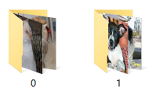
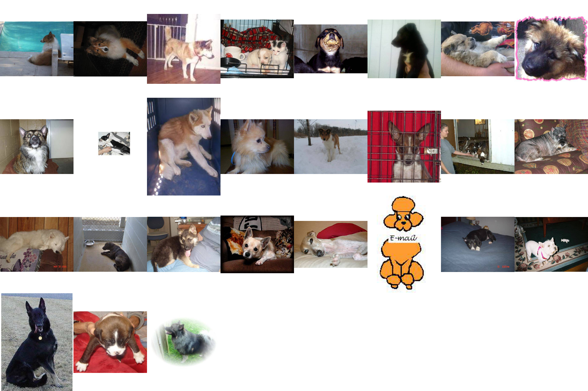

# 动手学深度学习——5. 数据清洗

记录一下学习深度学习的一些。本篇简述如何使用 [cleanlab](https://github.com/cgnorthcutt/cleanlab) 清洗分类数据

所使用环境：

- Ubuntu 16.04
- 8700K
- GeForce RTX 1080Ti
- Python 3.8
- Pytorch 1.7.1
- cleanlab 0.1.1

## 数据准备

首先将上篇所说的猫狗大战的训练集，按猫狗分为0/1两个目录，父目录命名为 **train**，接着将两类图片分类，按名字检索一下就可以分开。



因为图片的大小不一，所以在进行交叉验证训练的时候，使用随机缩放裁剪将图片处理至统一尺度，方便训练。

```python
train_dataset = datasets.ImageFolder(
	traindir,
	transforms.Compose([
		transforms.RandomResizedCrop(224),
		transforms.RandomHorizontalFlip(),
		transforms.ToTensor(),
		normalize,
	]),
)

val_dataset = datasets.ImageFolder(
	valdir,
	transforms.Compose([
		transforms.RandomResizedCrop(224),
		transforms.RandomHorizontalFlip(),
		transforms.ToTensor(),
		normalize,
	]),
)	
```

## 数据清洗

### 交叉验证获取预测概率矩阵 `psx`

```shell
python train_crossval.py -a efficientnet-b6 -o output -j 4 -b 20 --epochs 10 --lr 0.001 --pretrained --world-size 1 --rank 0 --dist-url tcp://localhost:8001 --multiprocessing-distributed --cvn 5 --cv 0 --num-classes 2 data
```

修改参数 `cv`，直至 k 折交叉验证均完成，相应的 **out-of-sample**  预测概率 $\hat{P}_{k,i}$ 的 `npy` 文件会生成至 `output ` 参数所指定的目录。这里有一点不同的是，官方提供的实例是使用 **val** 目录下的数据集来调优的，而我用交叉验证的 **holdout** 部分，所以效果可能会有所下降。

### 合并所有的 `npy` 文件，生成完整的 `psx`

```python
python train_crossval.py -a efficientnet-b6 --cvn 5 -o output --num-classes 11 --combine-folds data
```

### 获取错误的标签及对应的原始标签

```python
python get_error_labels.py --psx output/train__model_efficientnet-b6__pyx.npy -db output/test.db -t test data/train
```

### 查看结果

```shell
Overall accuracy: 98.12%
Total: 101
```

可以看到通过 cleanlab，25,000 张训练图像中有 101 的错误标注，通过图来验证一下。

原始标签为猫的，cleanlab 预测为狗的：


原始标签为狗，cleanlab 预测为猫的：



可以看到上述结果中，有部分是地区被标注错误了的，还有一部分的卡通图及其他非猫/狗图，还有一部分同时出现两种的，当然也还有有一部分出错了，但还是具有一定的参考意义。

## Code

- [Script](../code/5.Cleaner)