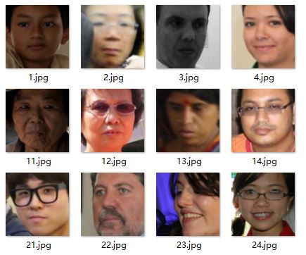
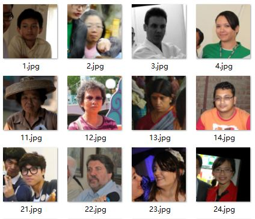
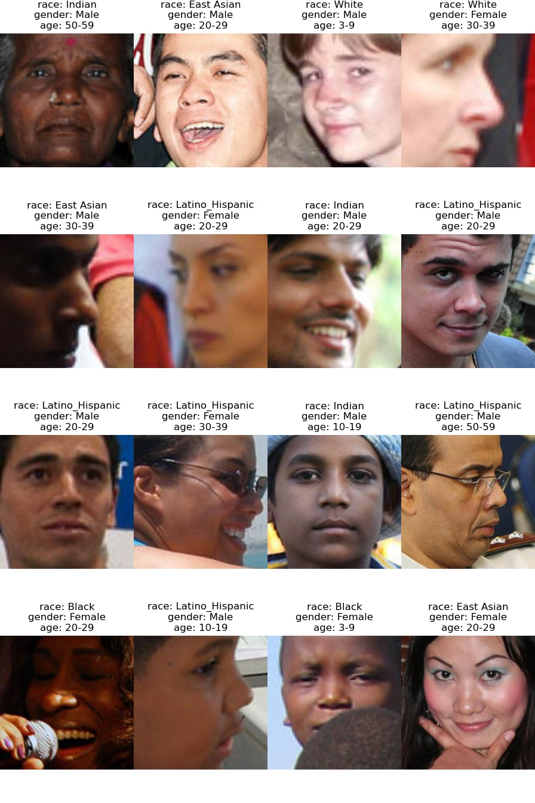

# 动手学深度学习——6. FairFace多标签分类

记录一下学习深度学习的一些。本篇简述使用 fairface 训练一个关于人脸的多标签分类器，并且使用 pytorch 的 [**DDP**](https://pytorch.org/tutorials/intermediate/ddp_tutorial.html) 加速训练。

环境：

- ubuntu 16.04
- 2080Ti * 6
- Pytorch 1.2.0

本次训练用到 [EfficientNet](https://github.com/tensorflow/tpu/tree/master/models/official/efficientnet)，[paper](https://arxiv.org/abs/1905.11946)，这里用 [EfficientNet-PyTorch](https://github.com/lukemelas/EfficientNet-PyTorch) 版本。

安装：

```SHELL
pip install efficientnet_pytorch
```

## 数据准备

[FairFace](https://github.com/dchen236/FairFace) 是这篇 [paper](https://openaccess.thecvf.com/content/WACV2021/papers/Karkkainen_FairFace_Face_Attribute_Dataset_for_Balanced_Race_Gender_and_Age_WACV_2021_paper.pdf) 所提供的一个数据集，包含 7 个种族，9 个年龄段及性别。

```python
age_labels = ['0-2', '10-19', '20-29', '3-9', '30-39', '40-49', '50-59', '60-69', 'more than 70']
gender_labels = ['Female', 'Male']
race_labels = ['Black', 'East Asian', 'Indian', 'Latino_Hispanic', 'Middle Eastern', 'Southeast Asian', 'White']
```

下载地址：

- [Github](https://github.com/dchen236/FairFace#data)
- [百度网盘](https://pan.baidu.com/s/17rIQmpHgzJiUzYJmRi3iSQ)：v1xn

### 预览

margin025：



margin125：



### 编码标签

官方提供的标签文件并不能直接用来训练，需要编码为分类数据才能使用。training labels 前10条

```
file,age,gender,race,service_test
train/1.jpg,50-59,Male,East Asian,True
train/2.jpg,30-39,Female,Indian,False
train/3.jpg,3-9,Female,Black,False
train/4.jpg,20-29,Female,Indian,True
train/5.jpg,20-29,Female,Indian,True
train/6.jpg,20-29,Male,White,True
train/7.jpg,40-49,Male,Middle Eastern,False
train/8.jpg,30-39,Female,Indian,True
train/9.jpg,10-19,Male,White,True
train/10.jpg,30-39,Male,Middle Eastern,False
```

这里使用 `sklearn` 提供的 `LabelEncoder`，`OneHotEncoder` 来进行编码

```
import argparse
import pandas as pd
from sklearn.preprocessing import LabelEncoder, OneHotEncoder

if __name__ == '__main__':
    parser = argparse.ArgumentParser(formatter_class=argparse.ArgumentDefaultsHelpFormatter)
    parser.add_argument('--csv', type=str, help='path to annotation file')
    parser.add_argument('--output', type=str, help='path to output file')
    args = parser.parse_args()
    df_res = pd.DataFrame()
    df = pd.read_csv(args.csv)
    df_res['file'] = df['file']
    label_encoder = LabelEncoder()
    one_hot_encoder = OneHotEncoder(dtype=int)
    for column in df.columns[1:-1]:
        features = df[column].values
        fit = label_encoder.fit_transform(features)
        features = one_hot_encoder.fit_transform(fit.reshape(-1,1))
        df_res[label_encoder.classes_] = features.toarray()
    df_res.to_csv(args.output, index=False)
```

```shell
python labels_encode.py --csv path_to_label --output path_to_output
```

编码后：

```
file,0-2,10-19,20-29,3-9,30-39,40-49,50-59,60-69,more than 70,Female,Male,Black,East Asian,Indian,Latino_Hispanic,Middle Eastern,Southeast Asian,White
train/1.jpg,0,0,0,0,0,0,1,0,0,0,1,0,1,0,0,0,0,0
train/2.jpg,0,0,0,0,1,0,0,0,0,1,0,0,0,1,0,0,0,0
train/3.jpg,0,0,0,1,0,0,0,0,0,1,0,1,0,0,0,0,0,0
train/4.jpg,0,0,1,0,0,0,0,0,0,1,0,0,0,1,0,0,0,0
train/5.jpg,0,0,1,0,0,0,0,0,0,1,0,0,0,1,0,0,0,0
train/6.jpg,0,0,1,0,0,0,0,0,0,0,1,0,0,0,0,0,0,1
train/7.jpg,0,0,0,0,0,1,0,0,0,0,1,0,0,0,0,1,0,0
train/8.jpg,0,0,0,0,1,0,0,0,0,1,0,0,0,1,0,0,0,0
train/9.jpg,0,1,0,0,0,0,0,0,0,0,1,0,0,0,0,0,0,1
train/10.jpg,0,0,0,0,1,0,0,0,0,0,1,0,0,0,0,1,0,0
```

## 训练

因为训练集有 8 万左右的图片，所以使用 Pytorch 的 DDP 来加速

```shell
python train.py --arch efficientnet-b6 --distributed --multi  --pretrained --num-classes 18 --epochs 100 -b 120 -j 24 --output output --val-csv labels/fairface_label_val.csv --vdata data --csv labels/fairface_label_train.csv data
```

使用了水平翻转来进一步增强数据，6 张卡的训练速度为 10 分钟一个 epoch，10 张 6 分钟。因为后续的 val_loss 不再下降了，所以没有完全训练完100轮，最终结果如下：

**best：**

```shell
[2021-04-20 22:50:32,362] [train] [I]: Training
[2021-04-20 22:59:10,779] [train] [I]: Epoch: [15] [700]/[722](96.95%) Loss: 0.1108 / 0.1359 / 0.1354 Acc: 0.91 / 0.86 / 0.86 Recall: 0.80 / 0.78 / 0.79
[2021-04-20 22:59:26,952] [train] [I]: Validating
[2021-04-20 22:59:46,176] [train] [I]: Epoch: [15] [50]/[92](54.35%) Loss: 0.1968 / 0.2196 / 0.2128 Acc: 0.71 / 0.77 / 0.77 Recall: 0.65 / 0.70 / 0.71
```

**75:**

```
[2021-04-21 08:23:40,830] [train] [I]: Training
[2021-04-21 08:32:05,544] [train] [I]: Epoch: [75] [700]/[722](96.95%) Loss: 0.0648 / 0.0919 / 0.0915 Acc: 0.96 / 0.92 / 0.92 Recall: 0.93 / 0.88 / 0.88
[2021-04-21 08:32:20,907] [train] [I]: Validating
[2021-04-21 08:32:37,897] [train] [I]: Epoch: [75] [50]/[92](54.35%) Loss: 0.2281 / 0.2691 / 0.2688 Acc: 0.74 / 0.78 / 0.77 Recall: 0.67 / 0.72 / 0.71
```

## 验证

简单得预测一些图来看一下结果

```shell
python inference.py --arch efficientnet-b6  --num-classes 18 --gpu 0 --num-visualize 32 --model path_to_your_model path_to_your_data
```




## Code

- [Scripts](../code/6.FairFaceClassifier)