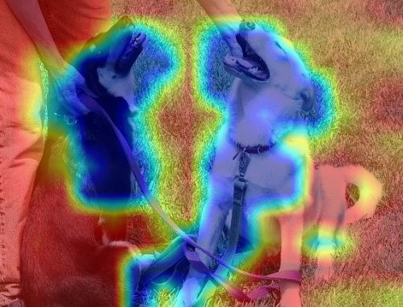

# 动手学深度学习——7. CNN可视化

记录一下学习深度学习的一些。本篇记录一下使用 **Grad-CAM** 可视化 CNN。

环境：

- Windows 10
- 8700K
- 2070
- Pytorch 1.7.1

深度学习在很多任务上，特别是计算机视觉上取得了不错的成功，但其不具备良好的可解释性，被当作"黑盒"， [Grad-CAM](https://arxiv.org/abs/1610.02391) (Gradient-weighted Class Activation Mapping) 以及 [Grad-CAM++](https://arxiv.org/abs/1710.11063) 是神经卷积网络的可视化方法 (热力图)，图片上越热的地方对网络输出贡献最大的地方。本篇使用的是 Github 上的 [pytorch-grad-cam](https://github.com/jacobgil/pytorch-grad-cam)。

安装：

```shell
pip install grad-cam
pip install ttach

```

## 可视化

可用方法：

```python
methods = {
    "gradcam": GradCAM,
    "scorecam": ScoreCAM,
    "gradcam++": GradCAMPlusPlus,
    "ablationcam": AblationCAM,
    "xgradcam": XGradCAM,
    "eigencam": EigenCAM,
    "eigengradcam": EigenGradCAM,
}
```

```
python cnn_visualizations.py --arch resnet50 --ckpt path_to_model --num-classes 2 --target-layer layer4 --method name_of_method --output dir_to_output path_to_image 
```

 效果：

| method       | src                       | cam                                        | gb                           | cam_gb                                        |
| ------------ | ------------------------- | ------------------------------------------ | ---------------------------- | --------------------------------------------- |
| gradcam      |  |       |  |       |
| scorecam     |                           |      |  |      |
| gradcam++    |                           |     |  |     |
| ablationcam  |                           |   |  |   |
| xgradcam     |                           |      |  |      |
| eigencam     |                           |      |  |      |
| eigengradcam |                           |  |  |  |

可以看到图片之所以被网络认为狗子，是因为它的嘴巴及狗链，鼻子呢？

## Code

- [Scripts](../code/7.CNNVisualizations)