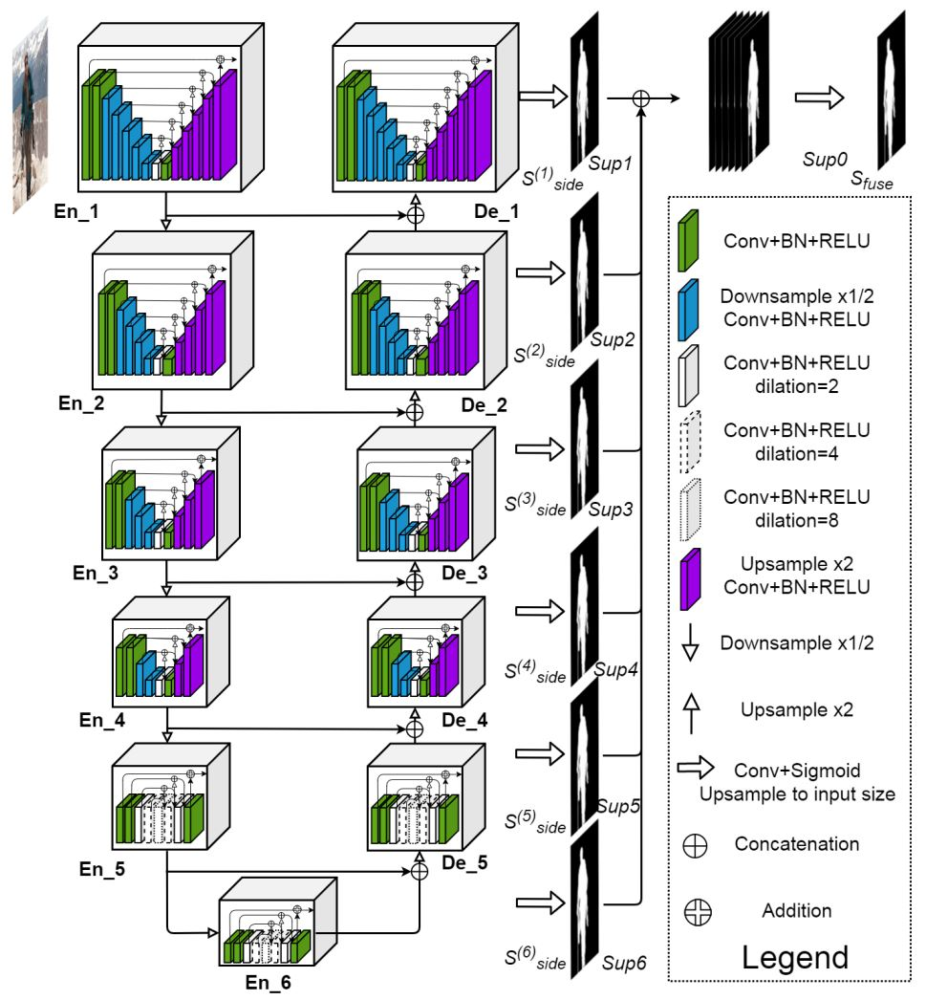
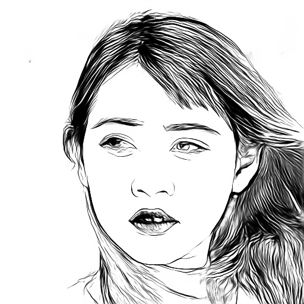
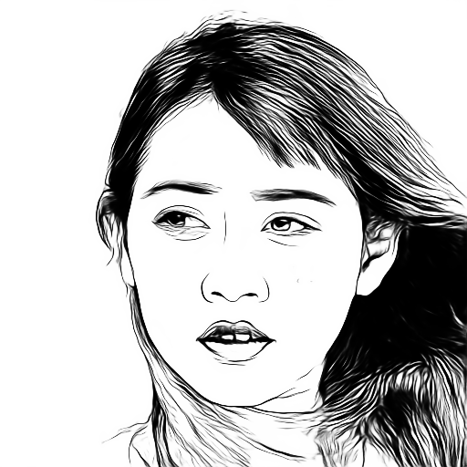
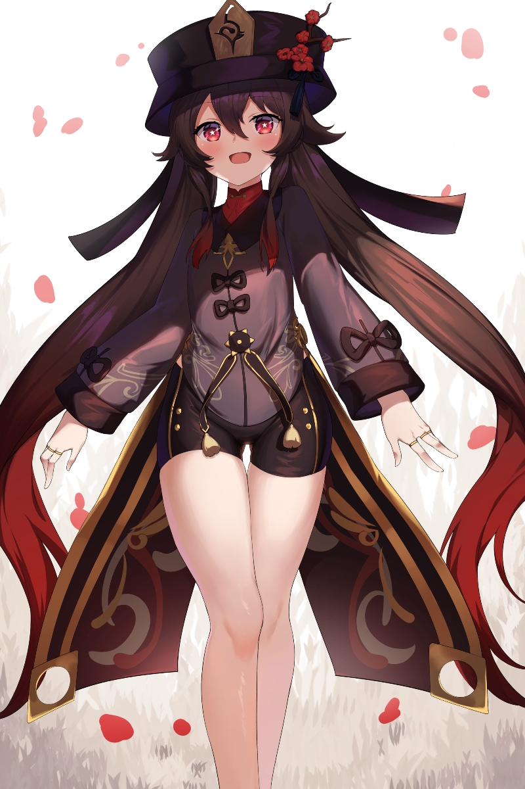
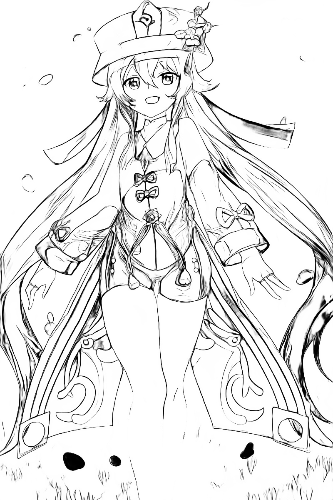
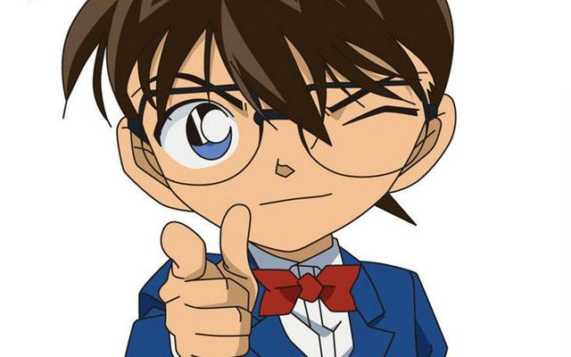
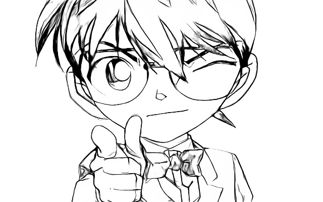
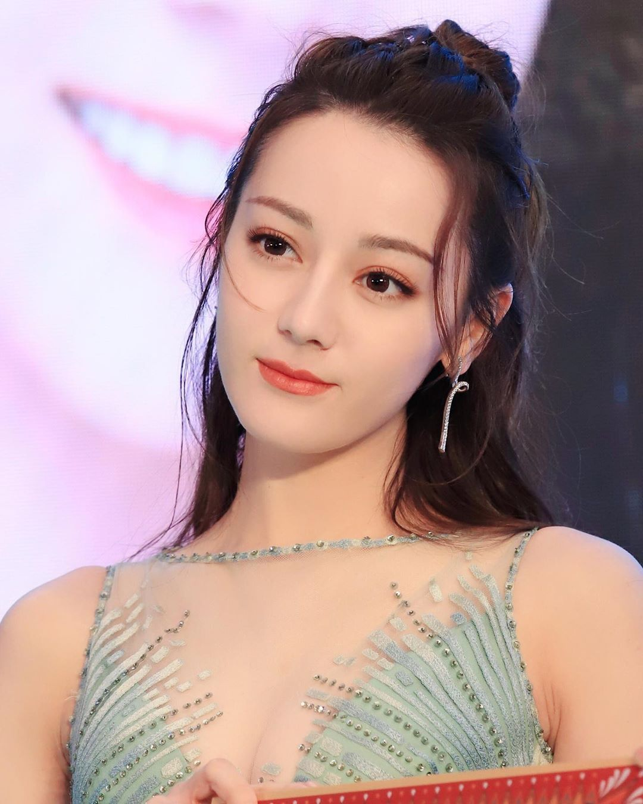
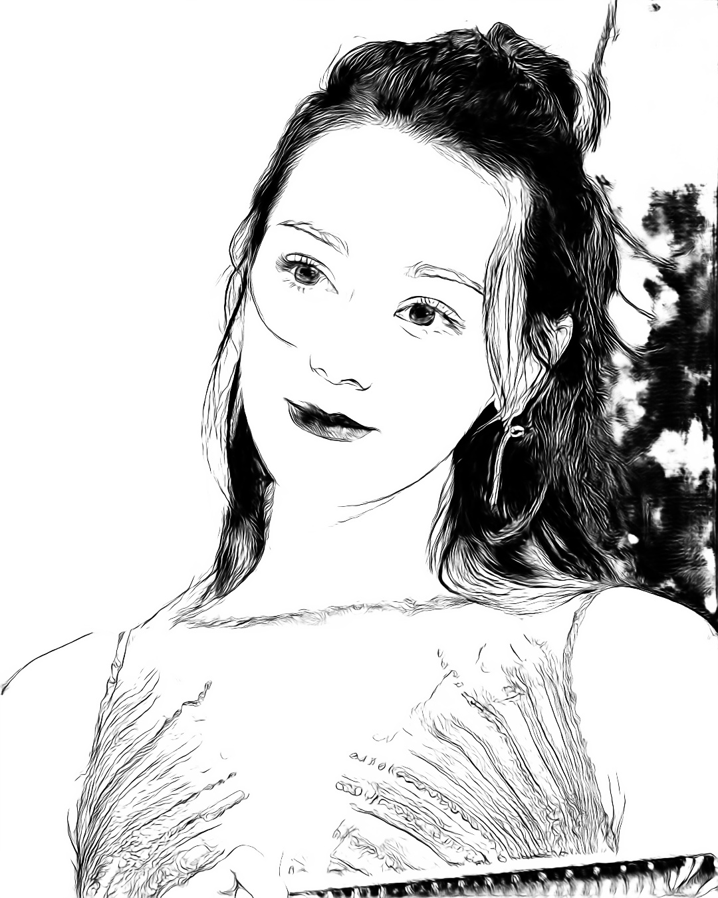

# 动手学深度学习——8. 人物肖像画

记录一下学习深度学习的一些。本篇记录一下使用 [U^2-Net](https://github.com/xuebinqin/U-2-Net) ([paper](https://arxiv.org/pdf/2005.09007.pdf)) 生成人物肖像画，还有 [APDrawingGAN](https://github.com/yiranran/APDrawingGAN)。

环境：

- Windows 10
- 8700K
- 2070
- Pytorch 1.7.1

U^2-Net 是一个用于显著目标检测的网络 (Salient Object Detection)，至于为什么叫 U^2-Net，看网络结构



**checkpoints:**

- [GoogleDrive](https://drive.google.com/file/d/1IG3HdpcRiDoWNookbncQjeaPN28t90yW/view?usp=sharing)
- [Baidu pan](https://pan.baidu.com/s/1BYT5Ts6BxwpB8_l2sAyCkw)：chgd

## 肖像生成

使用 U^2-Net 生成肖像很简单，官方提供详细的[操作流程](https://github.com/xuebinqin/U-2-Net#usage-for-portrait-generation)，不过有一点小瑕疵的就是，官方在测试的时候别没有禁用梯度，也就是没有在 `with torch.no_grad():` 域下进行 `forward`，占用不少显存，导致一些分辨率稍大的图片，例如 1080P 之类在本机会报错 OOM。同时，[demo](https://github.com/xuebinqin/U-2-Net/blob/master/u2net_portrait_demo.py) 的 normalize 与 [test](https://github.com/xuebinqin/U-2-Net/blob/master/u2net_portrait_test.py) 不同，会导致结果稍微差一点，表现明显的就是头发没那么密实，所以我修改了一番。

demo：

```python
input = input/np.max(input)

tmpImg[:,:,0] = (input[:,:,2]-0.406)/0.225
tmpImg[:,:,1] = (input[:,:,1]-0.456)/0.224
tmpImg[:,:,2] = (input[:,:,0]-0.485)/0.229
```

fixed：

```python
img = img / np.max(img)
tmpImg[:, :, 2] = (img[:, :, 0] - 0.406) / 0.225
tmpImg[:, :, 1] = (img[:, :, 1] - 0.456) / 0.224
tmpImg[:, :, 0] = (img[:, :, 2] - 0.485) / 0.229
```

生成：

```shell
python pics_2_portrait.py --ckpt path_to_model --output dir_to_output input_dir
```

对比结果：

| demo                               | test                             | fixed                       |
| ---------------------------------- | -------------------------------- | --------------------------- |
|  |  |  |

效果展示：

| src                  | dst                      |
| -------------------- | ------------------------ |
|  |  |
|  |  |
|  |  |

可以看到第三张的背景有点瑕疵，可见对于复杂背景的还是难以处理，当然也可能和训练模型的数据有关，作者使用的是 [APDrawing dataset](https://cg.cs.tsinghua.edu.cn/people/~Yongjin/APDrawingDB.zip)，实体较少，就140名不同的艺术家的面部照片，分辨率为 $512 \times 512$，其余的都是增强得来，即旋转缩放之类。

这个网络不仅可以生成人物的肖像，还可以生成其他生物的，我试了一些狗子的，效果尚可。待有空再试一下用 [U^2-Net](https://github.com/xuebinqin/U-2-Net) 训练肖像生成，人像分割和显著物体检测，还有 [APDrawingGAN](https://github.com/yiranran/APDrawingGAN)。

## 视频生成

素描视频生成其实就是将视频的每帧读取出来，按照单张相片进行处理，处理完毕后再写入文件即可。这里的视频读取及写入分别使用了 OpenCV 的 [VideoCapture](https://docs.opencv.org/master/d8/dfe/classcv_1_1VideoCapture.html) 和 [VideoWriter](https://docs.opencv.org/master/dd/d9e/classcv_1_1VideoWriter.html)。

```shell
python video_2_portrait.py --ckpt path_to_model --output path_to_output_video path_to_video
```

由于视频素材不好找，而且处理时间过长，没有效果展示了。尝试了一下 16 分钟的 1080P 的 60fps 的视频，处理时间长达8小时。

## Code

- [Scripts](../code/8.Portrait)